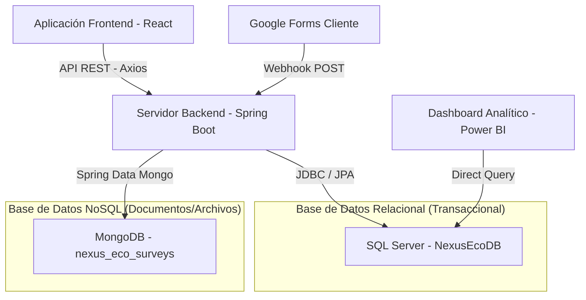
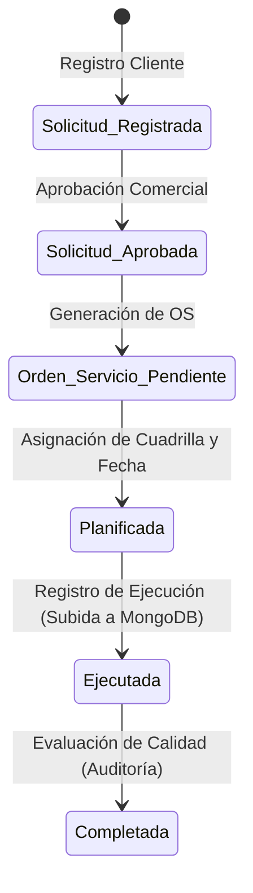

# Arquitectura de Bases de Datos Híbrida - Econexus

Este documento detalla la topología de base de datos, conexiones, flujo de datos e integración lógica del sistema **Econexus** para el proyecto final de **Base de Datos II**.

---

## 1. Topología de Datos (Persistencia Híbrida)

Econexus utiliza una **arquitectura de persistencia políglota** (híbrida), combinando un motor relacional (SQL Server) y uno no relacional (MongoDB) para aprovechar las fortalezas de cada tecnología:

### A. SQL Server (`NexusEcoDB` - Relacional OLTP)
* **Propósito:** Almacenar datos transaccionales, estructurados y críticos del negocio que requieren consistencia estricta, llaves foráneas e integridad referencial (ACID).
* **Conexión (Spring Boot - `application.yml`):**
  * **Driver:** `com.microsoft.sqlserver.jdbc.SQLServerDriver`
  * **URL:** `jdbc:sqlserver://localhost:1433;databaseName=NexusEcoDB;encrypt=true;trustServerCertificate=true`
  * **Credenciales:** Usuario `nexus_user` / Contraseña `nexus123`
* **Entidades Principales:**
  * `CLIENTE`, `CONTACTO_CLIENTE`, `EMPLEADO`, `TIPO_SERVICIO`
  * `SOLICITUD_SERVICIO`, `ORDEN_SERVICIO`, `DETALLE_ORDEN`
  * `PLANIFICACION_SERVICIO`, `TECNICO_PLANIFICACION`
  * `EJECUCION_SERVICIO` (Guarda el ID físico y los metadatos)
  * `AUDITORIA_CALIDAD`

### B. MongoDB (`nexus_eco_surveys` - NoSQL Documental)
* **Propósito:** Almacenar datos no estructurados, de esquema variable o archivos binarios de gran tamaño.
* **Conexión (Spring Boot - `application.yml`):**
  * **URL:** `mongodb://localhost:27017/nexus_eco_surveys`
* **Colecciones:**
  * `encuestas_satisfaccion`: Almacena las encuestas que los clientes responden mediante **Google Forms**.
  * `fs.files` y `fs.chunks` (GridFS): Almacena las actas físicas y evidencias firmadas en PDF o JPG subidas durante el registro de ejecución de servicios.

---

## 2. El Puente de Integración Híbrido (Cross-Database Referencing)

La relación entre los datos estructurados en SQL Server y los archivos en MongoDB se gestiona a nivel de código (Spring Boot) mediante una **clave de referencia lógica**:

1. **Subida de Archivos:** Cuando un técnico registra una ejecución en la pantalla, sube una foto o PDF. El backend de Spring Boot recibe el archivo y lo guarda en la colección GridFS de **MongoDB**.
2. **Generación del ID:** MongoDB genera un identificador único único (ej. `"64f8a1b2c3d4..."`).
3. **Guardado del Link:** Spring Boot inserta una fila en la tabla `EJECUCION_SERVICIO` de **SQL Server**, almacenando dicho identificador en la columna `mongo_doc_id` (tipo `VARCHAR(100)`).
4. **Descarga de Evidencias:** Cuando el supervisor quiere auditar el servicio, el frontend solicita el ID de SQL Server, el backend realiza la búsqueda en MongoDB por el ID almacenado en la base relacional, y transmite el archivo al cliente.

---

## 3. Flujo de Datos Transaccional (Cambios de Estado en Cascada)

Para asegurar la coherencia del negocio, el backend gestiona una máquina de estados mediante transacciones en la base de datos:

1. **Aprobación de Solicitud:** Al guardar una `ORDEN_SERVICIO`, un trigger lógico cambia el estado de la `SOLICITUD_SERVICIO` asociada a `APROBADA`.
2. **Ejecución Técnica:** Al insertar una fila en `EJECUCION_SERVICIO` (SQL Server) y almacenar el documento en MongoDB:
   * El estado de la `PLANIFICACION_SERVICIO` cambia a `EJECUTADO`.
   * El estado de la `ORDEN_SERVICIO` cambia a `COMPLETADO`.
3. **Consistencia:** Toda la lógica de actualización en cascada está envuelta en anotaciones `@Transactional` en Spring Boot. Si la base de datos SQL Server o MongoDB falla, se ejecuta un rollback total.

---

## 4. Integración del Flujo Google Forms $\rightarrow$ MongoDB

Para evitar el desarrollo de una interfaz de encuestas compleja, el sistema aprovecha una automatización serverless:
1. El cliente escanea el código QR de su informe de servicio y abre un formulario en **Google Forms**.
2. Al enviar la respuesta, un trigger de **Google Apps Script** intercepta los datos y realiza una solicitud HTTP POST al webhook del backend:
   `POST http://localhost:8080/api/encuesta-satisfaccions/webhook`
3. El controlador Spring Boot procesa el JSON recibido y lo guarda directamente en la base de datos **MongoDB** en la colección `encuestas_satisfaccion` sin tocar SQL Server.
