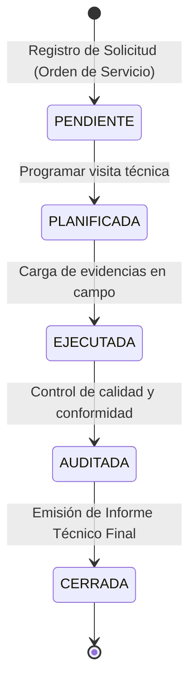

# Guía Completa: Flujo de Negocio, Máquina de Estados y Arquitectura de Datos

Este documento sirve como material de estudio detallado sobre el funcionamiento del sistema **Econex (Nexus Eco Soluciones)**. Explica el flujo de datos de extremo a extremo (End-to-End), las validaciones a nivel de base de datos relacional y no relacional, y las restricciones del lado del cliente.

---

## 🏗️ 1. Arquitectura de Persistencia Políglota

El sistema combina el almacenamiento relacional y documental para maximizar la eficiencia y consistencia del negocio:

```
                  ┌──────────────────────────────────────────┐
                  │          Cliente React Frontend          │
                  └────────────────────┬─────────────────────┘
                                       │
                                       ▼
                  ┌──────────────────────────────────────────┐
                  │        Spring Boot REST API (Backend)    │
                  └────────────┬────────────────────┬────────┘
                               │                    │
                  (Datos Estructurados)     (Documentos y Binarios)
                               │                    │
                               ▼                    ▼
                    ┌─────────────────────┐┌─────────────────────┐
                    │      SQL Server     ││       MongoDB       │
                    │   (Base de Datos)   ││   (Base de Datos)   │
                    └─────────────────────┘└─────────────────────┘
```

1. **SQL Server (Transaccional/Relacional):**
   * Almacena datos estructurados, de auditoría y facturación donde la integridad referencial y las transacciones ACID son críticas (ej. `CLIENTE`, `ORDEN_SERVICIO`, `PLANIFICACION_SERVICIO`, `AUDITORIA`).
2. **MongoDB (No Relacional/Documental):**
   * Almacena encuestas dinámicas desde Google Forms (`encuestas_satisfaccion`).
   * Almacena archivos binarios y firmas digitalizadas mediante GridFS (`evidencias`) para no sobrecargar el almacenamiento relacional de SQL Server.

---

## 🔄 2. El Ciclo de Vida del Servicio (Ciclo Operativo)

El ciclo operativo sigue un flujo secuencial estricto controlado por una máquina de estados:



### Detalle de los Estados Lógicos de la Orden:
* **PENDIENTE / EN_PROCESO:** La orden se ha creado a solicitud del cliente. Es editable y borrable.
* **PLANIFICADA:** La orden tiene una fecha y hora programada, así como técnicos asignados. Ya no se puede modificar ni eliminar el catálogo de servicios.
* **EJECUTADA:** El técnico en campo completó la tarea, cargó las observaciones y las evidencias a la base de datos de MongoDB. La planificación ya no es editable.
* **AUDITADA:** Un supervisor realizó el control de calidad, asignando una calificación (1-5 estrellas). Habilita la generación del reporte técnico final.
* **CERRADA (Informe Generado):** Se emitió el informe oficial para el cliente. El ciclo se da por completado.

---

## 🔒 3. Restricciones de Integridad y Reglas de Negocio (Triggers)

Para evitar inconsistencias en el tiempo (como programar visitas sobre órdenes canceladas o generar informes de servicios sin auditar), se implementaron restricciones directamente en **SQL Server** mediante Triggers:

| Trigger | Tabla | Evento | Regla de Negocio Enforcada |
|---|---|---|---|
| **`TR_ValidarEstadoPlanificacion`** | `PLANIFICACION_SERVICIO` | `AFTER INSERT` | Bloquea la creación de más de una planificación activa para la misma Orden de Servicio para evitar agendamientos redundantes. |
| **`TR_ValidarEstadoEjecucion`** | `EJECUCION_SERVICIO` | `AFTER INSERT, UPDATE` | Impide registrar una ejecución sobre visitas que no se encuentren en estado `PROGRAMADO` o `EJECUTADO` en el calendario. |
| **`TR_ValidarEstadoAuditoria`** | `AUDITORIA` | `AFTER INSERT, UPDATE` | Prohíbe auditar la calidad de un servicio que no cuente con una ejecución física registrada previamente en la base de datos. |
| **`TR_ValidarEstadoInforme`** | `INFORME_SERVICIO` | `AFTER INSERT, UPDATE` | Impide emitir y enviar el informe técnico final al cliente si la ejecución no cuenta previamente con la auditoría aprobada del supervisor. |

---

## 💻 4. Flujo Detallado de Pantallas y Efectos en Persistencia

### Paso 1: Registro de Clientes y Contactos
* **Módulo:** `Clientes`
* **Acciones:** CRUD de empresas y asignación de contactos de cuentas.
* **Persistencia:** Inserta en **`CLIENTE`** y **`CONTACTO_CLIENTE`** (SQL Server).

### Paso 2: Solicitudes y Órdenes de Servicio
* **Módulo:** `Solicitudes`
* **Acciones:**
  * Permite crear la Orden de Servicio vinculando el cliente, servicios requeridos y precios.
  * **Regla de Interfaz:** Los botones **Editar** y **Eliminar** se ocultan si el estado es diferente a `PENDIENTE` (evita alterar precios de servicios ya planificados o ejecutados).
  * **Botón Detalles:** Permite abrir un modal popup para auditar qué servicios y cantidades integran la orden.
* **Persistencia:** Inserta en **`SOLICITUD_SERVICIO`**, **`ORDEN_SERVICIO`** y **`DETALLE_ORDEN`** (SQL Server).

### Paso 3: Planificación y Asignación de Recursos
* **Módulo:** `Planificación`
* **Acciones:**
  * El selector de órdenes excluye automáticamente aquellas que ya tienen una planificación activa para evitar duplicados en la UI.
  * Se asigna la ubicación de la visita y los técnicos (definiendo 1 Líder Técnico y Asistentes).
  * **Regla de Interfaz:** Si el estado es `EJECUTADO`, los botones de modificar y eliminar la planificación se bloquean para resguardar la validez histórica del servicio en campo.
  * **Botón Detalle (👁️):** Modal popup que muestra la ubicación exacta del servicio y los técnicos asignados de forma visual.
* **Propagación Automática:** Spring Boot intercepta el guardado y cambia el estado de la `ORDEN_SERVICIO` a **`PLANIFICADA`**. Si la planificación se elimina, revierte el estado a **`EN_PROCESO`**.
* **Persistencia:** Inserta en **`PLANIFICACION_SERVICIO`**, **`UBICACION`** y **`TECNICO_PLANIFICACION`** (SQL Server).

### Paso 4: Ejecución en Campo y Carga de Evidencias
* **Módulo:** `Ejecución`
* **Acciones:**
  * Si la planificación no ha sido ejecutada, muestra el botón **"Registrar Ejecución"**.
  * Si ya fue ejecutada, el botón cambia a **"Editar Registro"** (para añadir aclaraciones técnicas) y habilita el botón **"Evidencias"**.
  * **Generación de ZIP:** Al hacer clic en el botón de evidencias, el backend Spring Boot consulta a MongoDB, recopila todos los archivos binarios (firmas y fotos de inspección) asociados a esa ejecución y los empaqueta en un **archivo ZIP descargable** con un solo clic.
  * **Botón Detalle (👁️):** Permite ver en un popup las observaciones detalladas y la bitácora técnica de la ejecución.
* **Propagación Automática:** Cambia el estado de la `PLANIFICACION_SERVICIO` a **`EJECUTADO`** y de la `ORDEN_SERVICIO` a **`EJECUTADA`**.
* **Persistencia:** Inserta en **`EJECUCION_SERVICIO`** (SQL Server) vinculando el ID del documento físico de evidencias en MongoDB (`mongo_doc_id`).

### Paso 5: Auditoría de Calidad
* **Módulo:** `Auditoría`
* **Acciones:**
  * El supervisor evalúa el cumplimiento de EPPs, limpieza de la zona de trabajo y asigna una calificación de 1 a 5 estrellas.
  * Permite registrar incidentes y darles seguimiento hasta su cierre.
  * **Generar Informe:** El botón principal **"Generar Informe Final"** se habilita dinámicamente **únicamente** si el listado de auditorías asociadas a la ejecución contiene al menos un registro. Al pulsarlo, redirige al usuario a la sección de Informes.
* **Propagación Automática:** Cambia el estado de la `ORDEN_SERVICIO` a **`AUDITADA`**.
* **Persistencia:** Inserta en **`AUDITORIA`**, **`INSPECCION`**, **`INCIDENTE`** y **`SEGUIMIENTO_INCIDENTE`** (SQL Server).

### Paso 6: Generación de Informes y Exportación a PDF
* **Módulo:** `Informes`
* **Acciones:**
  * Muestra el resumen de los reportes listos para enviar al cliente.
  * El formulario de creación filtra y muestra **exclusivamente** las ejecuciones que se encuentren en estado **`AUDITADA`**, impidiendo reportar visitas sin control de calidad.
  * **Generación de PDF:** El botón verde **"PDF"** de la tabla abre una ventana de impresión limpia y profesional, cargando el logotipo de Econexus, datos del cliente, la lista detallada de servicios cobrados con precios, las observaciones de campo del técnico y la calificación de calidad en estrellas junto al dictamen de auditoría del supervisor.
* **Persistencia:** Inserta en **`INFORME_SERVICIO`** (SQL Server).

---

## 🗳️ 5. Integración Externa: Encuesta de Satisfacción (Google Forms a MongoDB)

La retroalimentación del cliente no se digita en nuestro sistema, sino que se captura desde una encuesta oficial de Google Forms para garantizar la neutralidad:

```
 [Cliente llena Google Form]
              │
              ▼
    [Hoja de Cálculo de Google]
              │
              ▼ (Trigger Apps Script: ON_FORM_SUBMIT)
     [Webhook HTTP POST JSON]
              │
              ▼ (URL expuesta por ngrok / Túnel público)
┌──────────────────────────────────────────────┐
│  Spring Boot Webhook (/webhook)              │
│  - Realiza Fuzzy Matching del nombre         │
│    del cliente con SQL Server                │
│  - Calcula promedio ponderado de KPIs        │
│  - Almacena en MongoDB                       │
└──────────────────────┬───────────────────────┘
                       │
                       ▼
┌──────────────────────────────────────────────┐
│  Colección MongoDB: encuestas_satisfaccion   │
└──────────────────────────────────────────────┘
```

1. **El Cliente responde:** Ingresa a la encuesta, califica la amabilidad, puntualidad, limpieza y deja sus sugerencias.
2. **Google Apps Script:** Al procesarse la respuesta, Apps Script empaqueta la información y realiza una llamada HTTP:
   `POST /api/encuesta-satisfaccions/webhook` enviando el JSON estructurado.
3. **Procesamiento en Backend:**
   * **Fuzzy Matching:** Busca en la tabla `CLIENTE` (SQL Server) si el nombre del cliente ingresado en la encuesta coincide con alguna Razón Social registrada, asignándole el `idCliente` de forma automática.
   * **KPIs y Métricas:** Parsea las respuestas cualitativas (ej. "A tiempo" -> 5 puntos, "Tarde" -> 3 puntos) y calcula la puntuación promedio general.
   * **Persistencia Documental:** Guarda el objeto procesado en la colección `encuestas_satisfaccion` de **MongoDB**.
4. **Dashboard de Calidad:** La pantalla **Satisfacción (Mongo)** consulta a MongoDB para mostrar el promedio de KPIs generales del negocio en tiempo real.
